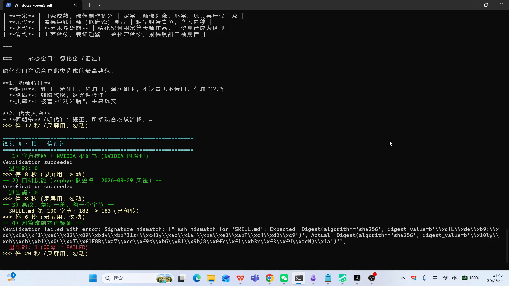
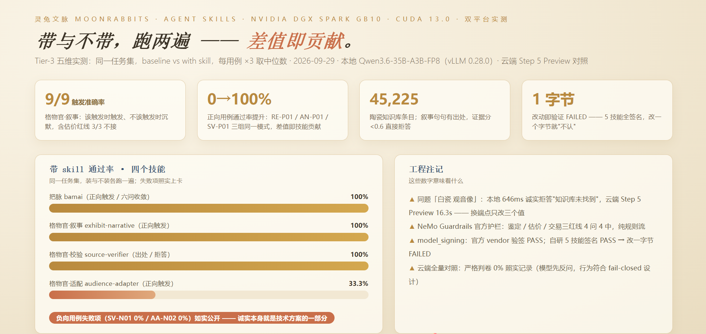

# 灵兔文脉 MoonRabbits

> **拍一件展品，带走它的时代故事。**
> Take a photo of an exhibit — bring home the story of its age.

**灵兔文脉（MoonRabbits）是一个文化遗产多智能体叙事系统。**

它只做一件事：让观众对着展柜里的器物拍一张照，就能听见一段**每一句都有出处**的故事——从釉色、工艺、窑口讲到一个时代的气息；而**讲不出来源的时候，宁可说"我不知道"**。

系统的哲学框架取自中华文明的**五色观**：「一色一季、一季一载体」——
第一季「白」（白瓷）已验证，其后依次为青、赤、黄、黑，把陶瓷史串成一条可以走下去的路。

系统的内部形态是**多专家协同**：考据官、格物官、灵感官分头取证，讲述者整合成文，
校验官在输出前逐句核对——**批评 → 修复 → 审查**，复核签字才放行。

> 博物馆里最珍贵的不是展品，是信任。所以我们先解决信任，再解决漂亮。



> 官方技能的签名验得过，我们自己技能的签名也验得过；改掉一个字节，它立刻不认。
> **信任不来自注册表的徽章，来自可验证的完整性。**（图为演示视频帧三实测画面）

---

## 本次交付：把这套系统的「叙事能力」做成 Agent Skills 套件

> 第三届 NVIDIA DGX Spark 黑客松 · Agent Skills 方向 ｜ 队伍：**zephyr**

这次交的**不是一个新 demo**，而是把上面这套多专家叙事系统里**能复用的那部分，固化成了可安装、可组合、可验证的技能**：
**把脉**（需求工程化，入口）→ **格物官 · 多专家编排**（叙事 / 校验 / 适配，主体）→ **NVIDIA 资源粘合**（引擎与治理，底座）。

> **一句话**：拍一件展品，带走它的时代故事。
> 而这句话背后，是一条**写死在技能里的执行规则**（`fail-closed`）：每一句都要有出处，讲不出来源的，宁可说"我不知道"——并且有**负向用例**在评测它。

---

## 📄 提交材料

| # | 材料 | 位置 |
|---|---|---|
| ① | 项目说明（≥500 字） | 本 README §三 |
| ② | 部署说明 | 本 README §四 ｜ **在线演示（公网）：https://moonrabbits-narrative-guide.netlify.app** （入口页 / 系统演示 / 作品展示页） |
| ③ | 技术栈说明（NVIDIA SDK / 模型 / StepFun） | 本 README §五 + [`NVIDIA-STACK.md`](NVIDIA-STACK.md) |
| ④ | 演示视频 | **▶ [B 站：灵兔文脉 MoonRabbits｜让每一句讲解都有出处](https://www.bilibili.com/video/BV16vaW6EEic/)** ｜ 结构与自查见 [`media/README.md`](media/README.md) |
| ⑤ | 赛事征文 · 十日谈 | **▶ [知乎：十日谈 · 灵兔文脉 MoonRabbits](https://zhuanlan.zhihu.com/p/2088415588293010984)** ｜ 篇目见 [`docs/提交-征文-十日谈.md`](docs/提交-征文-十日谈.md) |
| ⑥ | 评测证据（Tier-3 五维 + 官方验签） | [`EVAL-NOTE.md`](EVAL-NOTE.md)（口径）· [`SIGNING.md`](SIGNING.md) · **原始数据全在 [`evidence/`](evidence/)**：本地腿 5 组 · 云端腿 53 例 · 双端点对照 · 官方 API 实测 · 官方技能验签 |
| ⑦ | 团队合影 | 随提交表单提交（不公开） |

全量索引见 [`docs/提交-材料总表.md`](docs/提交-材料总表.md)。

## 五条不可妥协的设计决定

1. **fail-closed，而不是"尽力而为"** —— 知识库检索不到就明确说「知识库未找到」，证据分 < 0.6 直接拒答；宁可少讲，不讲错的。
2. **窄触发、强路由** —— 一个技能只管一类事：`SKILL.md` 是路由表不是百科；负触发词比正触发词更难写，也更值钱。
3. **关键判定不靠模型感觉** —— 年代差 > 50 年、置信度差 > 0.3、证据分阈值全部由确定性脚本裁定（`verify_sources.py`，零网络零随机，同一输入必同一输出）。
4. **官方技能一个字节不改** —— vendor 冻结 + `LOCK.json` 逐文件 sha256；环境差异只进 `adapter/`，业务逻辑只进自研技能。
5. **信任来自可验证的完整性** —— 自研技能全部签名；改一个字节，`model_signing verify` 立刻 FAILED。

---

## 一、Skill 套件（可组合）

作品 = 三个 skill 角色的落地：**把脉（入口）→ 格物官·多专家编排（主体）→ NVIDIA 资源粘合（底座）**。

> **哲学内核（甲方定案）**：道生一，一生二，二生三，三生万物。
> - **把脉 = 一生二（分）**：从一团混沌的想法里问出清浊、拆出结构——业务语言翻译成工程语言；
> - **格物官 = 二生三（博弈）**：叙事官/校验官/适配官三专家各执一词、互相校验，生出经得起查的"三"——每句有出处、查不到就拒答（SignalForge 三思想：模型不拥有系统 / 拒绝即功能 / 批评→修复→审查）；
> - **粘合 = 三生万物（合）**：官方积木 + 自研 + 算力合流成一条链，落地成视频、小程序、讲解——万物。
> - 整体是**从合到分、分再到合**；中间的能量，来自校验、拒答、签名这些"对抗产生信任"的机制。

| skill | 中文名 | 一句话 | 可独立使用 | 治理产物 |
|---|---|---|---|---|
| **`bamai`** | 把脉 | 像中医把脉：从一段人话里摸出真正的需求，再开成一张能落地的方子 | ✅ | SKILL.md ✅ · skill-card ✅ · evals ✅ · BENCHMARK ✅ · 签名 ✅ |
| **`exhibit-narrative`** | 展品叙事官 | 展品照片/信息 → **每句可溯源**的叙事 + 出处 + 置信度 | 需知识库 | SKILL.md ✅ · skill-card ✅ · evals ✅ · BENCHMARK ✅ · 签名 ✅ |
| **`source-verifier`** | 溯源校验官 | 对任意文本逐句找出处、给置信度、暴露冲突——**只校验不生成** | ✅ **通用件，零领域依赖** | SKILL.md ✅ · skill-card ✅ · evals ✅ · BENCHMARK ✅ · 签名 ✅ |
| **`audience-adapter`** | 观众适配官 | 按观众画像换表达与详略——**只换表达，不换事实** | ✅ | SKILL.md ✅ · skill-card ✅ · evals ✅ · BENCHMARK ✅ · 签名 ✅ |
| `base-memory-navigator` | 基座记忆导航 | 开工前先问后读，用最经济的方式对齐上下文（早期试水） | ✅ | SKILL.md ✅ · skill-card ✅ · evals ✅ · BENCHMARK ✅（对照参考） |

**Skill 3（NVIDIA 资源粘合）的落地 = 本仓库根目录的装配层**：`vendor/`（官方技能冻结）+ `LOCK.json`（锁 commit + sha256）+ `scripts/`（sync / verify-lock / pre-push-check）+ `adapter/`（环境差异层）。见 §5.2。

### 组合链路

```
bamai  →  exhibit-narrative  →  audience-adapter  →  source-verifier
   问清需求、拆好任务       产生内容 + 出处       换表达，不动事实       最后一道闸
```

**为什么是"一套"而不是"一个"**：
- 赛题 25% 权重明写「**Skills 设计与融合**」——可组合、可复用，强于单个孤立 skill；
- `source-verifier` **不含任何文博知识** → 任何"不许编造"的任务都能挂上它；
- 各技能职责单一（窄触发），符合官方心法「**SKILL.md 是路由表不是百科**」。

---

## 二、评委 3 分钟验证路径

> 官方自己承认一个**未解决的开放问题**：
> 「触发稳定性目前是相对不太稳定的，比如 Claude 常常不会主动触发 skill」（训练营口播）。
> 所以我们把"怎么验证它真的触发了"写在最前面。

```bash
# 1. 零依赖脚本，立刻可跑（纯 Python 标准库，不需要装任何东西）
python skills-src/exhibit-narrative/scripts/verify_sources.py --input examples/case.json --pretty

# 2. 知识库连通性自检（条数应接近 45,225；本机未装依赖时明确报"未安装"，绝不假装"库里没有"）
python skills-src/exhibit-narrative/scripts/kb_search.py --self-check

# 3. 官方与自研技能的完整性核对（官方 39 + 自研 30，0 mismatch）
node scripts/verify-lock.mjs

# 4. 推送前三道闸（密钥 / 官方文件改动 / 自研契约）
node scripts/pre-push-check.mjs

# 5. 评测用例（含负向用例：正确答案是"不调用该 skill"）
#    见 skills-src/*/evals/evals.json
```

**预期看到什么**：
- `verify_sources.py` 输出**五段报告**：校验结论 / 逐句出处 / 无依据断言 / 冲突清单 / 处理建议，三态判定（通过 / 部分通过 / **不通过**）；
- 负向用例**不该触发**该 skill —— 这是官方硬性要求，也是我们主动加固的地方；
- `verify-lock.mjs` 输出 `✅ OK, 0 mismatch`——官方与自研技能自冻结以来一个字节都没动。

---

## 三、项目说明

> 对应赛题要求②：**≥500 字**，含**作品特点亮点 / 技术方案 / 设计架构思路 / 优化方案**

### 3.1 作品特点与亮点

**1）一部"可验证的诚实"的机器。**
通用大模型讲展品，流畅但会编。我们把"编造"这件事从**提示词层面的叮嘱**，变成了**技能层面的硬约束**：知识库检索不到 → 明确输出「知识库未找到」→ 拒答。**证据分低于阈值就拒答，不给"凑合版"。**

**2）技能的可组合链路，两端延伸。**
入口端：`bamai` 把"非技术人的模糊想法"问清、拆活（苏格拉底式，最多六问）；主体端：叙事（产生）→ 适配（换表达）→ 校验（把关）；底座端：官方技能冻结装配（Skill 3）。`source-verifier` 不含领域知识，可挂到任何"不编造"的任务上。

**3）负向用例优先的设计。**
官方 Tier-3 要求任务集**必须包含负向用例**（正确答案是"不调用该 skill"的场景）。4 个核心技能共 **52 条用例**（16/13/12/11），其中 **12 条负向**（不该触发 / 越界拒答 / 拒绝打印密钥），另有 4 条 Efficiency 驻留用例正面测量官方点名的开放问题「Claude 常常不会主动触发 skill」。

**4）确定性内核，而非纯提示词。**
叙事链路的关键判定**不靠模型感觉**，由确定性规则锁定（`scripts/verify_sources.py`，纯函数、零网络、零随机）：
- 两条来源**年代差 > 50 年** → 两条都列 + 标注存疑，**不擅自二选一**
- 两条来源**置信度差 > 0.3** → 触发二次验证（找第三条来源）
- **证据分 < 0.6** → 判定不通过，建议拒答
- 受众权重矩阵 → 决定详略结构

**5）真实行业落地：博物馆 / 美术馆 / 文旅。**
不是玩具任务。知识库为真实的陶瓷史文献库（**45,225 条**，`BAAI/bge-large-zh-v1.5` 1024 维嵌入），来源包含《中国陶瓷史》与故宫讲座录音整理。

### 3.2 技术方案

| 层 | 方案 |
|---|---|
| **技能层** | Anthropic 开源 Agent Skills 规范：`SKILL.md` + `references/` + `scripts/` + `evals/`；三层渐进式披露（常驻 metadata ≈100 token → 命中读正文 <5K token → 执行时才调脚本） |
| **编排层** | Harness 加载技能目录，按 `description` 的触发词/负触发词路由；官方技能作积木，自研技能作胶水 |
| **装配层** | `LOCK.json` 锁上游 commit + 逐文件 sha256；`sync.mjs` 安装/校验/更新；`verify-lock.mjs` 完整性核对；`pre-push-check.mjs` 推送前三道闸；`adapter/` 环境差异（GB10 参数、端点三值） |
| **模型层** | 本地 **Qwen3.6-35B-A3B-FP8**（vLLM 0.28.0）＋ 云端 **StepFun Step 5 Preview**；**换模型只改三个值**（`base_url` / `model_name` / `api_key`） |
| **数据层** | ChromaDB 向量库 + 10 维标签（载体/色系/年代/工艺/纹饰/窑口/器形/来源/置信度/版本） |
| **证据层** | 三帧实测（造得出 / 换得动 / 信得过）+ Tier-3 五维 BENCHMARK |

### 3.3 设计架构思路

```
① 把脉（bamai）：模糊想法 → 最多六问（laoyeye）→ 澄清问题 + 工程需求 + 任务拆分
② 前置检查（图像可用？是否展品？参数够不够？）
      ↓ 不通过 → 先问用户，不许猜
③ 知识库检索（kb_search.py）—— 只从库取事实；库不可用 exit 3，绝不假装"库里没有"
      ↓ 命中为空 → fail-closed 拒答
④ 格物官多专家协同（叙事官 → 适配官 → 校验官）
⑤ 冲突校验（年代差 / 置信度差 / 证据分 / 受众矩阵）—— 必经闸门：证据分 < 0.6 直接拒答
⑥ 三角色质检（批评者 → 修复者 → 审查者）—— 复核签字才放行（SignalForge 三思想）
⑦ 输出契约（叙事正文 + 出处列表 + 置信度 + 使用提示）
```

**两条设计原则贯穿全链路**：
- **窄触发、强路由** —— 一个技能只管一类事，省 token 且不误伤；
- **安全边界内嵌** —— 不改 checked-in 配置、不打印明文 token、能复用缓存就不调贵模型。

### 3.4 优化方案

| 优化点 | 做法 | 状态 |
|---|---|---|
| **上下文经济** | 三层渐进式披露：常驻仅 `name`+`description` ≈100 token/技能；官方原话「没有人会全装 343 个技能，按需安装 + 目录路由才是工程上的正确解」 | ✅ 已实施 |
| **成本优化** | 轻量任务走本地模型（零 API 成本），重推理走云端；Step 5 Preview 官方口径「每任务成本比相近智能模型低约 65%」 | ✅ 已实测：本地 646 ms vs 云端 16.3 s（双端点同题对照，见 `evidence/`）；云端全量 53 例已跑 |
| **GB10 推理适配** | 必须 `VLLM_USE_DEEP_GEMM=0` + `--moe-backend triton`，否则 `CUDA_ERROR_INVALID_IMAGE` | ✅ 已验证 |
| **推理模型 token 坑** | `step-5-preview` 给 `max_tokens=16` 时 token 全被 `reasoning` 吃掉 → `content` 为空；已固化为默认 1024 + 空了自动放大 4 倍重试 | ✅ 已验证 |
| **检索质量** | 查询与入库必须同用 `bge-large-zh-v1.5`；库内 ASR 谐音脏数据用 fail-closed 缓解而非消除 | ✅ 已实施 |
| **推理引擎加速** | TensorRT-LLM / NIM | 📌 roadmap：本次**实跑 vLLM 0.28.0**；NIM 容器已尝试（受 nvcr.io 区域限制 451，如实记录），TensorRT-LLM 未实跑 |

---

## 四、部署说明

> 对应赛题要求③：说明**本地算力如何部署智能体 / 如何优化大模型 / 如何设计 Agent Skills**

### 4.1 硬件与运行环境（2026 本届实测值）

| 项 | 值 | 来源 |
|---|---|---|
| 硬件 | NVIDIA **DGX Spark（GB10）** | 实测 |
| GPU | NVIDIA GB10，驱动 580.142，**CUDA 13.0** | 实测 |
| 内存 | **121 GiB 统一内存**（CPU/GPU 共享） | 实测 |
| CPU | 20 核（ARM64） | 实测 |
| 磁盘 | 916 GB 总，769 GB 可用 | 实测 |
| 系统 | Ubuntu（ARM64 / SBSA）· Python 3.12.3 · Docker 29.2.1 | 实测 |
| 对外服务 | SSH / Jupyter·Web UI / 推理 API 各设有独立端口，**均启用 token 或密钥鉴权** | 实测 |

> 🔴 **端口号与节点地址不写入公开材料**（属"节点登录信息"，赛事规范禁止泄露）。只说明"有独立端口且已鉴权"，不列具体数字。

### 4.2 如何部署智能体

```bash
# 1. 本地模型服务（GB10 必须带这两个参数）
VLLM_USE_DEEP_GEMM=0 vllm serve ~/models/Qwen3.6-35B-A3B-FP8 \
  --moe-backend triton --port <PORT> --api-key <TOKEN>

# 2. 加载技能目录（harness 启动时一次性扫描）
openclaw skills list --eligible        # 官方验证命令

# 3. 可选：云端端点（改三个值即切换）
#    base_url = https://api.stepfun.com/step_plan/v1
#    model    = step-5-preview
#    api_key  = <环境变量，永不入库>
```

> ⚠️ 推理服务端口对外映射，**必须加 `--api-key` 鉴权**（组委会手册第八章硬性要求）。

### 4.3 如何优化大模型

我们**不训练、不微调模型**；优化全部发生在**上下文与编排层**：

1. **上下文经济** —— 三层渐进式披露，常驻 token 压到 ≈100/技能；
2. **模型分层** —— 本地小模型处理轻量任务（触发判断、工具调用），云端强模型处理重推理；
3. **推理模型 token 坑的工程化处理** —— 已固化为代码而非提示词叮嘱（见 §3.4）；
4. **GB10 专属参数** —— `VLLM_USE_DEEP_GEMM=0` + `--moe-backend triton`；
5. **换模型必须过回归评测** —— 官方铁律「**接口兼容 ≠ 行为等价**」，我们不只切过去就宣布成功。

### 4.4 如何设计 Agent Skills

| 步骤 | 我们的做法 |
|---|---|
| **1. 窄触发** | `description` 里同时写 **Triggers（正触发词）** 与 **Not for（负触发词）**。负触发那栏比正触发难写，也更值钱 |
| **2. 路由表而非百科** | `SKILL.md` 只做路由；细节放 `references/` 按需加载；重型操作放 `scripts/` |
| **3. 前置提问** | 关键参数不全 → **先问用户，不许猜**（官方心法之一） |
| **4. 安全边界内嵌** | 拒答边界、版权约束、密钥禁令**写进 SKILL.md**，不靠临时提醒 |
| **5. 输出契约** | 固定四段：叙事正文 / 出处列表 / 置信度 / 使用提示；附机器可读 JSON 字段（`title`/`content`/`tags`/`sources[]`/`trustNote`） |
| **6. 治理五道工序** | Cataloged → Scanned → Evaluated → Signed → Documented。每个技能必带 `skill-card.md` · `skill.oms.sig` · Tier-3 evals —— **缺一即被流水线拒绝**（官方原话） |
| **7. 不改官方技能** | 官方原话：「改了官方 Skill，签名就不再成立」。环境差异放适配层，业务逻辑放自研技能 |

---

## 五、技术栈说明

> 对应赛题要求④：列明 **NVIDIA SDK / NVIDIA 技术栈 / NVIDIA 模型 / StepFun 阶跃星辰模型**
> ⚠️ 下表**只列我们实际用到的**。官方目录有 41 条产品线、300+ 技能，「选对」比「堆多」重要。

### 5.1 NVIDIA SDK / 技术栈

| NVIDIA 技术 | 用途 | 我们的实际使用 | 状态 |
|---|---|---|---|
| **DGX Spark（GB10）** | 主硬件平台，121 GiB 统一内存 | 承载本地模型、知识库、技能编排全部组件 | ✅ 已用 |
| **CUDA 13.0** | GPU 计算支持 | 随 GB10 驱动 580.142 提供，支撑 vLLM 推理 | ✅ 已用 |
| **vLLM 0.28.0** | 推理服务（OpenAI 兼容端点） | 承载 Qwen3.6-35B-A3B-FP8，关键参数见 §4.2 | ✅ 已用 |
| **TensorRT-LLM** | 推理加速 | 本次以 vLLM 0.28.0 实跑（GB10 双参数已验证）；官方引擎列为下一步 | 📌 roadmap（未实跑，如实注明） |
| **NVIDIA NIM** | 微服务化模型接入 | 已尝试：本机生成 NGC key → `docker login nvcr.io` 401、镜像清单 **451（区域受限）**；官方云端 API（build.nvidia.com）实测可达作替代 | ⚠️ 已尝试受网络限制（如实记录） |
| **NeMo Guardrails** | 运行时护栏 | 三条红线（真伪鉴定/市场估价/文物交易）用官方护栏组件拦截：本机实测 **4 问 4 中**（纯规则流，不烧额度）；技能层负触发为第二道保险 | ✅ 已用 |
| **NVIDIA RAG Blueprint**（[NGC](https://catalog.ngc.nvidia.com/orgs/nvidia/blueprint/helm-charts/nvidia-blueprint-rag) · [部署指南](https://docs.nvidia.com/enterprise-reference-architectures/enterprise-rag-deployment-guide/latest/index.html)） | 企业知识库 RAG 官方参考架构 | 我们的检索层是这套架构的手工等价实现（摄取工序 / 嵌入 / 检索 / 重排 / 确定性校验一一对应），架构对齐、评测口径对齐（Tier-3 + rag-eval） | 📌 架构对标（蓝图本体未实跑：部署依赖 nvcr.io 容器，今晚实测区域受限 451，如实记录） |
| **RAPIDS cuVS** | GPU 向量检索加速 | 已在 DGX Spark（aarch64）**实装实导**（`cuvs-cu12==26.8.1`，导入版本 26.08.01，证据：`evidence/rapids-cuvs-实装证据.txt`）；高层 CAGRA 基准因 26.08 版本 API 迁移未跑通，如实记录 | ✅ 已装已导入 |
| **NVIDIA 官方 API**（build.nvidia.com） | 官方云端模型接口 | 密钥已验证、81 个模型名单可取、聊天端点 HTTP 200 实测可达 | ✅ 已实测 |
| **`model_signing`（OpenSSF）** | 技能签名验证 | `skill.oms.sig` 分离式签名 + 根证书校验 | ✅ vendor 官方技能验签已实测（PASS→篡改→FAILED）；**自研 5 技能已签**（zephyr 队 EC P-256 私钥），改一字节 → `Hash mismatch` FAILED 已实测 |

### 5.2 NVIDIA 技能生态：我们的选型（筛选，不全上）

官方目录 `github.com/NVIDIA/skills` 每日同步，**41 条产品线 · 300+ verified skills**（第三方实测 366–367 个）。我们**不是全装**，按四道筛子选出与本产品真正相关的：

> 四道筛子：① 需求匹配（查询/叙事/语音/治理 ↔ 产品链路）② 可跑性（赛期内、单机 DGX Spark、无企业授权）③ 官方 demo 路径 ④ 红线（不改官方、锁 commit、sha256 + 署名）。

| 档 | skill | 用法 |
|---|---|---|
| 🟢 实跑 | `nvidia-skill-finder` | 官方目录路由：演示"在几百个里选对"的方法与技能命中日志 |
| 🟢 实跑 | `skill-card-generator` | 官方治理卡片生成器（官方 demo 第 4 步同款工具；字段规范照此对齐） |
| ✅ 已取得并验签 | **`rag-blueprint`**（官方 RAG 部署技能） | 官方 PPT《NVIDIA Skills 开发实战》**第 11–13 页**列为重点产品线第一条（"Docker Compose / Helm 一键部署全栈 RAG"，垂类场景＝企业知识库/智能客服）；官方用法 `npx skills add nvidia/skills --skill rag-blueprint --yes`。**已取得 36 个文件（SKILL.md + 25 份 references + eval + skill-card + 官方签名），NVIDIA 根证书验签 PASS**（证据：`evidence/rag-blueprint-verify.txt`）。我们的检索层与其架构一一对应（摄取/嵌入/检索/重排/评测）。⚠️ 部署本体**未实跑**：依赖 nvcr.io 容器（实测区域受限 451），如实标注 |
| 🥈 冻结证据 | `tao-generate-image-grounding` · `tao-generate-referring-expressions` | 整目录冻结于 `vendor/`（锁 commit + sha256），证明"真比过、真筛过"；**不当主链路**（ARM64 容器未验证、单次 90–150 秒、搬不走） |
| 🟡 方法对标 | `nemotron-retrieval-recipes` · `rag-eval` | 检索"embed 召回 → rerank 排序"与 RAGAS 评测方法学，写入 BENCHMARK 协议与答辩口径 |
| 🔵 阶跃语音 | StepAudio Skills（StepFun 打包的 TTS/ASR） | 讲解语音：TTS 端点与模型名已通（`step-tts-mini`），官方 voice_id 列表未公开 → **如实标注"待验证"** |
| ⛔ 明确不用 | dynamo / megatron / slurm / jetson / doca / cuopt / tao-train / earth2studio / omniverse / warp / isaac… | 领域不符 / 无对应硬件 / 搬不走 |

**冻结与核验**：4 个官方技能整目录冻结于 `vendor/nvidia-skills/`（39 文件，含 SKILL.md / skill-card / skill.oms.sig / evals / BENCHMARK），`LOCK.json` 锁上游 commit，`scripts/verify-lock.mjs` 逐文件 sha256 核对（实测 0 mismatch）。一个字节都不改；环境差异全在 `adapter/`。

### 5.3 模型（含分工）

| 环节 | 模型 | 理由 |
|---|---|---|
| **拍照入口（视觉理解）** | **Step 5 Preview**（云端） | 原生图像输入，观众第一下动作由它接 |
| **工头 / 总调度** | **Step 5 Preview**（云端） | 1M 上下文装下任务+检索上下文+出处清单 |
| **考据 / 讲述（重推理成文）** | **Step 5 Preview**（云端） | 强推理、长输出；官方口径单任务成本低约 65% |
| 触发判断 / 检索词改写 / 格式整理 | **Qwen3.6-35B-A3B-FP8**（本地 vLLM） | 轻任务本地零成本 |
| **出处校验（确定性判定）** | 无模型——`scripts/verify_sources.py` 纯代码 | 同一输入必同一输出，关键判定不靠模型感觉 |

> 分工口径一句话：**DGX Spark 管本地和治理，StepFun 管入口和大脑，同一套接口，三个值就换。**

| 层 | 模型 | 规格 | 状态 |
|---|---|---|---|
| **本地推理** | **Qwen3.6-35B-A3B-FP8** | 35B 总参 / ≈3B 激活 · MoE · 权重 ≈37.5 GB · ModelScope 可取 | ✅ 已下载，vLLM 已装 |
| **本地备选** | **Nemotron-3.5-Lightning-30B-A3B-NVFP4** | 21 GB | ✅ 在位（未启用） |
| **嵌入** | **`BAAI/bge-large-zh-v1.5`** | 1024 维中文语义嵌入 | ✅ 已用于知识库 |
| **云端（阶跃星辰 StepFun）** | **Step 5 Preview** | 600B 总参 / 27B 激活 MoE · 1M 上下文 · 视觉输入 · 官方口径"相近智能下每任务成本低约 65%" | ✅ 端点已自检通过（`reply="通了"`） |
| **云端（阶跃星辰 StepFun）** | **Step 3.7 Flash** | 198B 总参 / 激活 11B / 1.8B 视觉编码器 · 256K · 图+视频 · 最高 400 tok/s · Apache 2.0 · **Day-0 上线 NIM** | 备选 |
| **云端端点** | `https://api.stepfun.com/step_plan/v1` | 订阅额度端点（另有按量端点 `/v1`） | ✅ 已用 |

> **两个 StepFun 型号并存是时间差，不是矛盾**：训练营 PDF（会前成稿）讲现网可用的 Step 3.7 Flash；当天口播宣布 Step 5 Preview。技术栈两者都列。

### 5.4 知识库与数据

| 项 | 值 |
|---|---|
| 向量库 | ChromaDB，集合 `moon_rabbits_kb` |
| 规模 | **45,225 条**（实测；另有 45,132 旧口径，以实测为准） |
| 嵌入 | `bge-large-zh-v1.5`（1024 维）— **查询必须同模型，否则检索整体失效** |
| 标签体系 | 10 维（载体/色系/年代/工艺/纹饰/窑口/器形/来源/置信度/版本） |
| 已知脏数据 | ASR 谐音错字（如"陶瓷史"→"桃子史"）、空标签、来源错标 —— **用 fail-closed 缓解，不掩饰** |

---

## 六、证据

> 官方三帧结构（训练营 StepFun demo）：**造得出 / 换得动 / 信得过**



> 带与不带，跑两遍——差值即技能的贡献。**失败的数字也印在卡上**：诚实本身就是技术方案的一部分。

| 帧 | 证据 | 状态 |
|---|---|---|
| **造得出** | 技能命中日志行（换第二件展品，一句话仍能触发） | ✅ 已录制并入片（B 站）；证据见 `evidence/frame1-local-*.txt` |
| **换得动** | 本地 vLLM ↔ `api.stepfun.com` 双端点对照 | ✅ 已录制并入片（B 站）；同题实测：本地 646 ms 拒答「知识库未找到」vs 云端 16.3 s 通用回答，数据见 `evidence/frame2-双端点对照-20260929.json` |
| **信得过** | ① 官方 `model_signing verify` + 根证书：vendor 官方技能验签 **PASS → 篡改一字节 → FAILED（已实测）** ② 自研完整性锁 `verify-lock.mjs`（sha256，篡改即 FAILED，已实测） ③ **自研 5 技能 `skill.oms.sig`：验证 PASS → 改一字节 → `Hash mismatch` FAILED（2026-09-29 已实测）** | ✅ ①②③ 全部实测 |
| **有用吗**（我们的加码） | Tier-3 五维 BENCHMARK：baseline vs with skill 差值 | ✅ 本地腿 5 组真数回填（失败项如实公开）+ 云端全量 **53 例**对照落盘（严格判卷结果照实记录） |

**Tier-3 五维**：`Security · Correctness · Discoverability · Effectiveness · Efficiency`

---

## 七、合规与边界

| 项 | 立场 |
|---|---|
| 真伪鉴定 / 市场估价 / 文物交易 | **永不提供**（写死在负触发里 + **NeMo Guardrails 官方护栏双重拦截**，4 问 4 中已实测） |
| 版权 | 只提取**事实**（年代/窑口/工艺）；叙事**原创生成**，不复制展签/图录原文 |
| 来源冲突 | **显式暴露** + 标注存疑，不擅自定论 |
| 密钥 | 不进前端 / 不进公开仓库 / 不进日志 / 不落文档 |
| AI 生成标注 | 输出按平台规范标注「AI 生成」 |
| 不替代人 | 定位为**辅助讲解**，不替代策展人、讲解员与专业鉴定机构 |

---

## 八、团队

| 成员 | 职责 |
|---|---|
| 项目负责人 | 产品定义、技能设计、内容审核、文化叙事方向把控 |
| 文化顾问（文博领域） | 文化内容深度支持、知识库专业性审核 |

> 团队合影见提交表单（按赛事要求⑦）。

---

## 九、License

Apache-2.0（技能部分；官方技能部分沿用其自带许可，见 `LOCK.json` 与各 `skill-card.md`）

---

*技术是手段，文化是目的。让 Agent 创作一切，但让人指导创作方向。*
